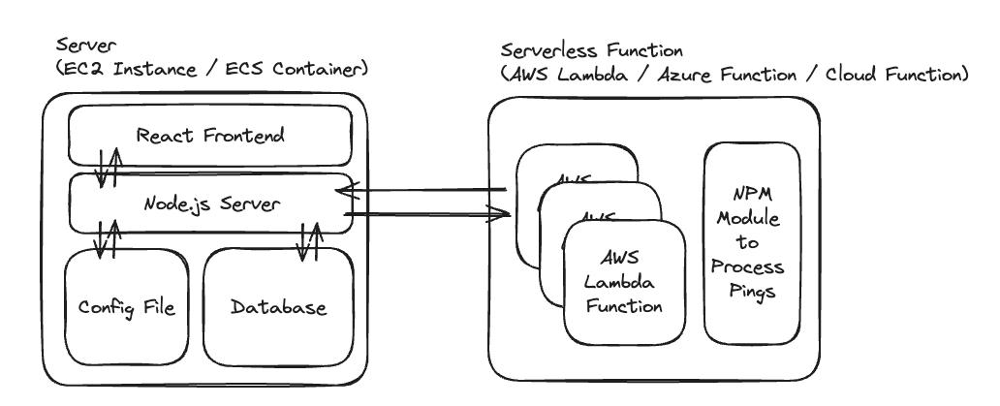

# serverlessPingPoC
Proof of Concept of Serverless Ping Project

### Minimum Proof of Concept this Works:

1. Spin up an Serverless function that responds
with current time and some indication if this was
a cold start.

2. Locally create a Node.js server that will run on
a team member's computer and send a request to
the serverless function on a schedule

3. Identify a cold-start, measuring either latency 
or load from memory, and verify that pinging more 
frequently removes cold-start challenges.

### High level Architecture

Node.js Server:
Hosted 24/7 - on a cadence defined by config, will send a request  to identified lambda functions, and record the latency of those responses in database. Based on the latency trend, will adjust the  frequency of pinging lambda functions. Will also serve this latency  data over time in a React app also running on the server.

AWS Lambda Functions:
Serverless functions the user wants to remain 'warm'. As part of this tool, the functions will have a small case statement that will receive a request and instead of fully processing the 'normal' function will instead just give  a response to the server indicating status (latency/coldstart boolean).

NPM Module to Process Pings:
Small package that can be added as case statement at beginning of function to be tested that will identify a request as being from our 'warming' service and will determine the correct steps to respond.

Config File:
File which specifies the (initial) cadence of sending requests to lambda  functions and the URL of those endpoints. May also contain authentication  information to ensure these are valid requests?

Database:
Records time-series data about latency of requests / boolean status  if the request is a coldstart or not. This data can be used to both adjust cadence of future requests to serverless functions and to visualize/provide performance data on app latency

React Frontend:
Displays performance data of requests to an end user. 